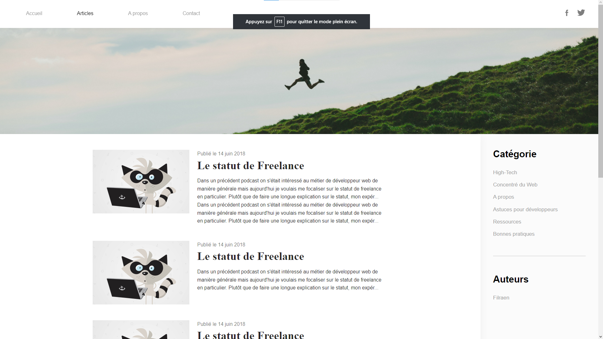
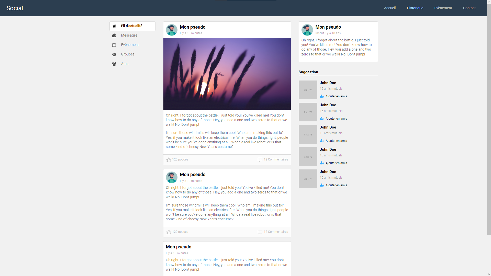
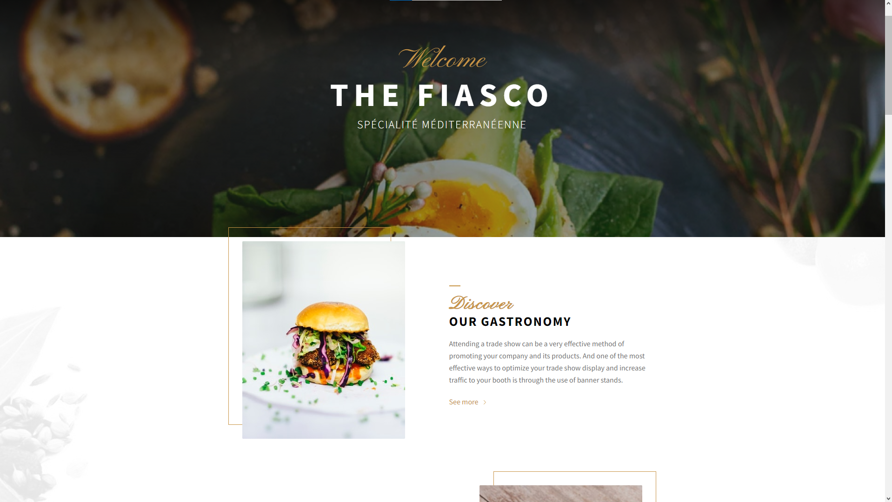

# Projets de Sites Web - Représentation de Maquettes Figma

## 📋 À propos
Ce dépôt contient trois projets de sites web, chacun représentant une maquette Figma. Ces projets ont été réalisés dans le cadre d'un travail de cours et illustrent différentes compétences en conception et développement web.

## 🌐 Projets Inclus

### 📰 Blog
Un site web de blog conçu pour une expérience utilisateur intuitive, offrant une lecture facile et une navigation claire.

### 🌐 Réseau Social
Une plateforme de réseau social avec une interface moderne, mettant l'accent sur l'interaction et la connectivité des utilisateurs.

### 🍽️ Restaurant
Un site web pour un restaurant, présentant un design attrayant et une interface conviviale pour une expérience utilisateur améliorée.

---

👨‍💻 Développé avec passion par Nicolas
